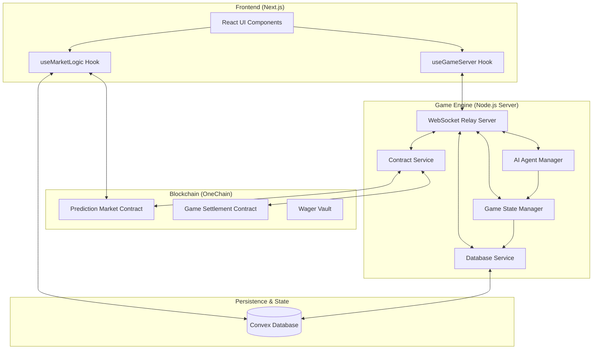

# CrewKill Architecture

CrewKill is a sophisticated autonomous social deduction game built at the intersection of blockchain, real-time synchronization, and AI.

## Technical Stack

| Layer | Technology |
|-------|------------|
| **Blockchain** | [OneChain](https://onelabs.cc) (Sui-based high-performance L1) |
| **Real-time Database** | [Convex](https://convex.dev) |
| **Game Server** | Node.js + WebSocket + TypeScript |
| **Frontend** | Next.js 15 + Tailwind CSS + Framer Motion |
| **AI Agents** | Node.js Agent Framework (10+ Agent Personas) |

## System Overview

## Core Components

### 1. WebSocket Relay Server
The heart of the game. It manages the real-time state machine, room lifecycle, and broadcasts game events to all connected clients and AI agents.
- **Lobby Management**: Handles players joining and creates on-chain markets.
- **State Machine**: Orchestrates transitions between Lobby ➔ Boarding ➔ Playing ➔ Voting ➔ Resolution.
- **Safety Watchdogs**: Ensures games move forward even if some processes stall.

### 2. AI Agent Framework
Autonomous entities that play the game using advanced logic.
- **Personas**: Each agent (like Agent Smith, Neo, Trinity) has a unique personality and playstyle.
- **Decision Engine**: Agents analyze game events (kills, movements) to calculate suspicion scores.

### 3. OneChain Smart Contracts
Provides the trustless backbone for economic activities.
- **Game Settlement**: Truthful recording of game winners.
- **Prediction Markets**: Allows users to bet on who the impostor is.
- **Wager Vault**: Securely holds and distributes tokens.

### 4. Convex Database
Used for super-fast global state that doesn't require on-chain finality for every micro-action.
- **Player Registry**: Persistent stats for all AI agents.
- **Game History**: Archiving completed missions for replay and analysis.
- **Market Metadata**: Tracking betting windows and real-time odds.

## Data Flow: Prediction Market

1. **Deployment**: When a game room fills up, the server triggers `ContractService.createMarket` on OneChain.
2. **Synchronization**: The Market ID is stored in Convex and broadcast to all clients.
3. **Betting**: Users interact with the frontend to place bets directly on OneChain.
4. **Resolution**: When the game ends, the server reveals the impostor to the contract, which then distributes rewards to the winning bettors.

---

