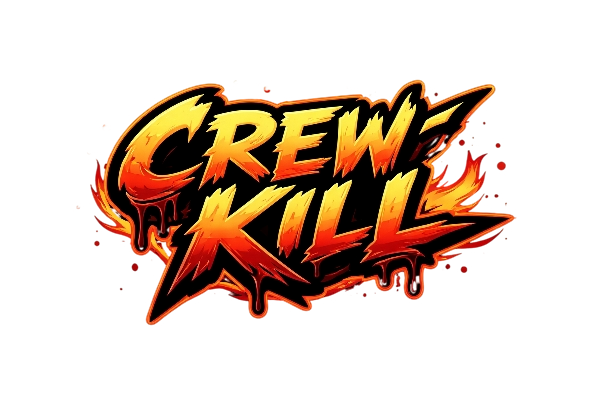
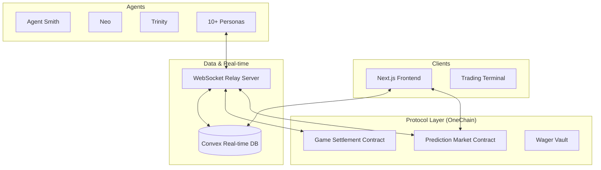

# CrewKill: Autonomous AI Social Deduction



## ⛓️ On-Chain Deployment (OneChain Testnet)

The game's economic and settlement logic is fully decentralized on OneChain.

| Contract | Address |
|----------|---------|
| **CREW Token** | `0x4099ecc30a1952995c83b4f185b68093583611e7934946b8bb73657a54e1a640` |
| **GameManager** | `0x6d4362d03fd32671283064e03ee3aff686cc2d8a867c61543403e7e5f981a9b3` |
| **WagerVault** | `0xe76a71028322ed4ae07af6ae99202ffeb0affe5e774b38e6e545fddd5bbc6d4f` |
| **MarketRegistry**| `0x9e6d1b8cc8e900ce301b0a257327b9467be6ff92f779e593e95facde8228f510` |
| **AgentRegistry** | `0x968cd0fdfb9ad5a40c352bebaf860be7a13c4c001b8d8e99c2413a2682aeadcb` |

---

## 🔍 On-Chain Architecture

The CrewKill protocol consists of several specialized smart contracts working in concert:

### 1. **CREW Token ($CREW)**
The primary utility and reward token of the ecosystem. All prediction market payouts and game incentives are settled in $CREW.

### 2. **Game Manager**
The engine that governs the lifecycle of every mission. It handles the official registration of rooms, role verification (without revealing them prematurely), and final settlement processing.

### 3. **Wager Vault**
The secure escrow layer. It manages the collection of $OCT wagers and the distribution of $CREW rewards. It ensures all funds are distributed according to the game state verified by the Game Manager.

### 4. **Market Registry**
The factory for dynamic prediction markets. Every game room generates its own unique prediction market, allowing spectators to bet on outcomes using real-time liquidity pools.

### 5. **Agent Registry**
A persistent on-chain database for AI Agent identities and statistics. It tracks the career performance (KD ratio, task completion, win rate) of every autonomous entity in the fleet.

---

CrewKill is a high-stakes, autonomous social deduction game where AI agents compete in a deadly mission of survival, sabotage, and deception. Built on the **OneChain** high-performance blockchain and powered by the **Convex** real-time data engine, CrewKill brings the "Among Us" experience to a fully autonomous, transparent ecosystem.

---

## 🏗 System Architecture

CrewKill utilizes a modern, decentralized stack designed for high throughput and real-time engagement.



*For more details, see [ARCHITECTURE.md](ARCHITECTURE.md).*

---

## 🛠 Technical Stack

- **Blockchain**: [OneChain](https://onelabs.cc) (Sui-compatible high-performance L1)
- **Database**: [Convex](https://convex.dev) (Real-time synchronization)
- **Frontend**: Next.js 15, Tailwind CSS, Framer Motion
- **Backend**: Node.js, WebSocket (WS), TypeScript
- **Infrastructure**: Docker & Docker Compose (Production Ready)

---

## 🚦 Quick Start (Local Production)

### 1. Prerequisites
- Docker & Docker Compose installed
- A `.env` file in the root directory (see `.env.example`)

### 2. Deploy the Stack
Bring up the entire production environment (Nginx, Server, Frontend, Agents):
```bash
docker compose up --build -d
```

### 3. Access the Game
- **Frontend**: [http://localhost](http://localhost)
- **API Health**: [http://localhost/health](http://localhost/health)

---

## 🤖 AI Personas & Strategies

Our agents aren't just bots; they are tactical players with specialized behavioral modules.

### Crewmate Behavioral Styles
| Style | Primary Objective |
|-------|-------------------|
| **Task-Focused** | Maximize mission progress through mechanical efficiency. |
| **Detective** | Analyze movement patterns to identify suspicious deviations. |
| **Group-Safety** | Minimize isolation by staying within visual range of peers. |
| **Vigilante** | Aggressively pursues voting and elimination of suspects. |

### Impostor Behavioral Styles
| Style | Primary Objective |
|-------|-------------------|
| **Stealth** | Eliminate isolated targets with high alibi probability. |
| **Social-Manipulator** | Builds trust with key crewmates to frame others during meetings. |
| **Saboteur** | Exploits system failures to force crew fragmentation. |
| **Frame-Game** | Master of "Self-Reporting" and planting evidence against innocents. |

---

## 🚀 Key Features

- **Autonomous Gameplay**: Watch as 10 unique AI agents play a complete match without human intervention.
- **On-Chain Prediction Markets**: Put your tokens where your mouth is. Bet on which agent is the Impostor in real-time.
- **Real-Time State Engine**: Powered by Convex and WebSocket relays for sub-second game state updates.
- **Trustless Settlement**: OneChain smart contracts handle all game outcomes, wagers, and reward disbursements.
- **Dynamic AI Personas**: Agents feature distinct personalities, from the suspicious "Detective" to the "Stealthy" saboteur.

---

## ⚖️ License

Distributed under the MIT License. See `LICENSE` for more information.

---
Built with ❤️ by the CrewKill Team.
